# Entity Relationship Diagram (ERD)

**Project:** EARTMP · **Phase:** 0 · **Status:** Draft, awaiting approval

This ERD covers all **23 entities** in `prisma/schema.prisma`, their
relationships, cardinalities, and key constraints. It is the data-model
companion to [database-design.md](database-design.md) and
[solution-architecture.md](solution-architecture.md).

> Notation: Mermaid `erDiagram`. `||--o{` = one-to-many (optional many);
> `||--|{` = one-to-many (mandatory many); `}o--o{` resolved via join tables.
> "PK" = primary key, "FK" = foreign key, "UK" = unique, "SD" = soft-delete
> (`deletedAt`).

## 1. Entity inventory (23)

| #   | Concern     | Entity                  | Append-only?        |
| --- | ----------- | ----------------------- | ------------------- |
| 1   | Auth/RBAC   | `Role`                  | no (SD)             |
| 2   | Auth/RBAC   | `Permission`            | no (SD)             |
| 3   | Auth/RBAC   | `RolePermission` (join) | no                  |
| 4   | Auth/RBAC   | `User`                  | no (SD)             |
| 5   | Institution | `Institution`           | no (SD)             |
| 6   | Institution | `Setting`               | no (SD)             |
| 7   | Academic    | `Faculty`               | no (SD)             |
| 8   | Academic    | `Department`            | no (SD)             |
| 9   | Academic    | `Programme`             | no (SD)             |
| 10  | Academic    | `Level`                 | no (SD)             |
| 11  | Academic    | `AcademicSession`       | no (SD)             |
| 12  | Academic    | `Semester`              | no (SD)             |
| 13  | People      | `Student`               | no (SD)             |
| 14  | Courses     | `Course`                | no (SD)             |
| 15  | Assessment  | `AssessmentType`        | no (SD)             |
| 16  | Assessment  | `AssessmentConfig`      | no (SD)             |
| 17  | Grading     | `GradeScale`            | no (SD)             |
| 18  | Results     | `Result`                | no (SD)             |
| 19  | Transcripts | `TranscriptTemplate`    | no (SD)             |
| 20  | Transcripts | `Transcript`            | no (SD)             |
| 21  | Audit       | `AuditLog`              | **yes (immutable)** |
| 22  | Ops         | `Backup`                | no (SD)             |
| 23  | Ops         | `Notification`          | no (SD)             |

## 2. Master ER diagram

```mermaid
erDiagram
    ROLE ||--o{ ROLE_PERMISSION : grants
    PERMISSION ||--o{ ROLE_PERMISSION : "granted by"
    ROLE ||--o{ USER : "assigned to"

    FACULTY ||--o{ DEPARTMENT : contains
    DEPARTMENT ||--o{ PROGRAMME : offers
    DEPARTMENT ||--o{ COURSE : owns
    DEPARTMENT ||--o{ STUDENT : enrolls
    PROGRAMME ||--o{ LEVEL : "structured into"
    PROGRAMME ||--o{ STUDENT : "admits to"
    PROGRAMME ||--o{ COURSE : "includes"
    LEVEL ||--o{ STUDENT : "at"
    LEVEL ||--o{ COURSE : "scheduled at"

    ACADEMIC_SESSION ||--o{ SEMESTER : "divided into"
    SEMESTER ||--o{ RESULT : "recorded in"

    STUDENT ||--o{ RESULT : earns
    COURSE ||--o{ RESULT : "assessed by"

    TRANSCRIPT_TEMPLATE ||--o{ TRANSCRIPT : renders
    STUDENT ||--o{ TRANSCRIPT : "issued"

    ROLE {
        string id PK
        string name UK
        string description
        datetime deletedAt "SD"
    }
    PERMISSION {
        string id PK
        string key UK
        string label
        datetime deletedAt "SD"
    }
    ROLE_PERMISSION {
        string roleId PK_FK
        string permissionId PK_FK
    }
    USER {
        string id PK
        string username UK
        string email UK
        string fullName
        string passwordHash "Argon2"
        string roleId FK
        bool isActive
        datetime lastLoginAt
        datetime deletedAt "SD"
    }
    INSTITUTION {
        string id PK
        string name
        string accreditationNo
        string logoPath
        string sealPath
        string registrarSignPath
        string calendarType "SEMESTER|TRIMESTER|QUARTER"
        string transcriptNumberRule
        datetime deletedAt "SD"
    }
    SETTING {
        string id PK
        string key UK
        string value "JSON"
        datetime deletedAt "SD"
    }
    FACULTY {
        string id PK
        string name
        string code UK
        datetime deletedAt "SD"
    }
    DEPARTMENT {
        string id PK
        string name
        string code UK
        string facultyId FK
        datetime deletedAt "SD"
    }
    PROGRAMME {
        string id PK
        string name
        string code UK
        string departmentId FK
        int durationLevels
        int creditsRequired
        datetime deletedAt "SD"
    }
    LEVEL {
        string id PK
        string name "100,200..."
        int rank
        string programmeId FK
        datetime deletedAt "SD"
    }
    ACADEMIC_SESSION {
        string id PK
        string name UK "2025/2026"
        datetime startDate
        datetime endDate
        bool isCurrent
        datetime deletedAt "SD"
    }
    SEMESTER {
        string id PK
        string name
        int rank
        string sessionId FK
        datetime deletedAt "SD"
    }
    STUDENT {
        string id PK
        string matricNumber UK
        string regNumber UK
        string fullName
        string departmentId FK
        string programmeId FK
        string levelId FK
        string facultyId "scalar*"
        string status "ACTIVE|...|GRADUATED"
        datetime deletedAt "SD"
    }
    COURSE {
        string id PK
        string code UK
        string title
        int creditValue
        string courseType "CORE|ELECTIVE|..."
        string departmentId FK
        string programmeId FK
        string levelId FK
        int semesterRank
        datetime deletedAt "SD"
    }
    ASSESSMENT_TYPE {
        string id PK
        string key UK "ca,exam"
        string label
        datetime deletedAt "SD"
    }
    ASSESSMENT_CONFIG {
        string id PK
        string name UK
        string components "JSON [{key,label,weight,maxScore}]"
        bool isDefault
        datetime deletedAt "SD"
    }
    GRADE_SCALE {
        string id PK
        string name UK
        string bands "JSON [{minMark,maxMark,grade,gradePoint,isPass}]"
        bool isDefault
        datetime deletedAt "SD"
    }
    RESULT {
        string id PK
        string studentId FK
        string courseId FK
        string semesterId FK
        string componentScores "JSON [{key,score}]"
        float finalScore
        string grade
        float gradePoint
        int creditsEarned
        bool isLocked
        datetime deletedAt "SD"
    }
    TRANSCRIPT_TEMPLATE {
        string id PK
        string name UK
        int version
        string layout "JSON ordered components"
        bool isDefault
        datetime deletedAt "SD"
    }
    TRANSCRIPT {
        string id PK
        string transcriptNumber UK
        string studentId FK
        string templateId FK
        string type "RESULT_SLIP|ACADEMIC_TRANSCRIPT|..."
        string snapshot "JSON frozen data"
        string verificationHash
        string status "DRAFT|APPROVED|LOCKED"
        datetime generatedAt
        datetime deletedAt "SD"
    }
    AUDIT_LOG {
        string id PK
        string userId
        string action "CREATE|UPDATE|DELETE|LOGIN|EXPORT"
        string entity
        string recordId
        string oldValue "JSON"
        string newValue "JSON"
        datetime createdAt "immutable, no SD"
    }
    BACKUP {
        string id PK
        string filePath
        int sizeBytes
        string type "MANUAL|AUTOMATIC|SCHEDULED"
        string schedule "DAILY|WEEKLY|MONTHLY"
        bool isCompressed
        datetime deletedAt "SD"
    }
    NOTIFICATION {
        string id PK
        string title
        string body
        string level "INFO|WARNING|ERROR"
        bool isRead
        datetime deletedAt "SD"
    }
```

## 3. Relationship catalogue & cardinalities

| Parent             | Child          | Card. | FK                            | Optional? | Notes                                             |
| ------------------ | -------------- | ----- | ----------------------------- | --------- | ------------------------------------------------- |
| Role               | User           | 1—N   | `User.roleId`                 | mandatory | A user has exactly one role.                      |
| Role               | RolePermission | 1—N   | `RolePermission.roleId`       | —         | join half.                                        |
| Permission         | RolePermission | 1—N   | `RolePermission.permissionId` | —         | join half. Composite PK `(roleId, permissionId)`. |
| Faculty            | Department     | 1—N   | `Department.facultyId`        | mandatory |                                                   |
| Department         | Programme      | 1—N   | `Programme.departmentId`      | mandatory |                                                   |
| Department         | Course         | 1—N   | `Course.departmentId`         | optional  | course may be cross-dept.                         |
| Department         | Student        | 1—N   | `Student.departmentId`        | optional  |                                                   |
| Programme          | Level          | 1—N   | `Level.programmeId`           | mandatory |                                                   |
| Programme          | Student        | 1—N   | `Student.programmeId`         | optional  |                                                   |
| Programme          | Course         | 1—N   | `Course.programmeId`          | optional  |                                                   |
| Level              | Student        | 1—N   | `Student.levelId`             | optional  | current level.                                    |
| Level              | Course         | 1—N   | `Course.levelId`              | optional  |                                                   |
| AcademicSession    | Semester       | 1—N   | `Semester.sessionId`          | mandatory | UK `(sessionId, rank)`.                           |
| Semester           | Result         | 1—N   | `Result.semesterId`           | mandatory |                                                   |
| Student            | Result         | 1—N   | `Result.studentId`            | mandatory |                                                   |
| Course             | Result         | 1—N   | `Result.courseId`             | mandatory | UK `(studentId, courseId, semesterId)`.           |
| TranscriptTemplate | Transcript     | 1—N   | `Transcript.templateId`       | mandatory |                                                   |
| Student            | Transcript     | 1—N   | `Transcript.studentId`        | mandatory |                                                   |

### Unmodelled / standalone entities

- `Institution`, `Setting`, `AssessmentType`, `AssessmentConfig`, `GradeScale`,
  `Backup`, `Notification`, `AuditLog` have **no FK relationships** in the
  schema — they are referenced **by value/key** (e.g. results carry a JSON of
  scores; grading is applied by the chosen `GradeScale` at processing time;
  audit rows reference `entity`+`recordId` as loose strings rather than FKs so
  the log can survive record deletion).

## 4. Key constraints

- **Uniqueness:** `Role.name`, `Permission.key`, `User.username`, `User.email`,
  `Faculty.code`, `Department.code`, `Programme.code`, `Level`? (no), course
  `Course.code`, `AcademicSession.name`, `AssessmentType.key`,
  `AssessmentConfig.name`, `GradeScale.name`, `TranscriptTemplate.name`,
  `Transcript.transcriptNumber`, `Student.matricNumber`, `Student.regNumber`.
- **Composite keys / uniques:** `RolePermission(roleId, permissionId)` PK;
  `Semester(sessionId, rank)` UK; `Result(studentId, courseId, semesterId)` UK
  — prevents duplicate result rows per student/course/semester.
- **Soft delete:** every table except `AuditLog` has `deletedAt`.
- **Immutability:** `AuditLog` has only `createdAt` (no `updatedAt`/`deletedAt`).
- **Enumerated strings** (SQLite has no native enums): `calendarType`,
  `Student.status`, `Course.courseType`, `Transcript.type`,
  `Transcript.status`, `Backup.type/schedule`, `Notification.level`,
  `AuditLog.action`. Enforced in the domain/Zod layer, not the DB. See
  [database-design.md](database-design.md) §"Enumerations".

## 5. Known modelling notes

- **`Student.facultyId` is a scalar without a relation** back to `Faculty`
  (faculty is normally derived via department → faculty). Documented as a
  deliberate gap; add an explicit relation only if direct student-by-faculty
  queries are needed (see `README.md` "Known gaps").
- **JSON-as-config columns** (`GradeScale.bands`, `AssessmentConfig.components`,
  `TranscriptTemplate.layout`, `Result.componentScores`,
  `Transcript.snapshot`, `Setting.value`) keep variable rules out of the
  schema — this is the mechanism behind "no hardcoded rules." Validation of
  these blobs is the domain layer's job, not the DB's.

_Related: [database-design.md](database-design.md) ·
[solution-architecture.md](solution-architecture.md)_
